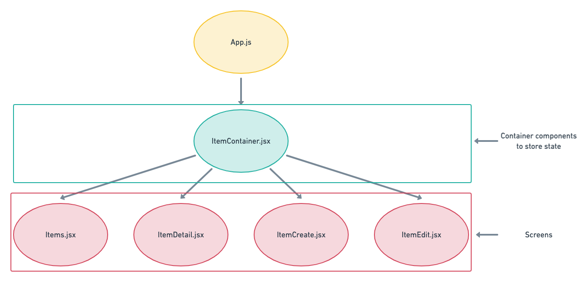
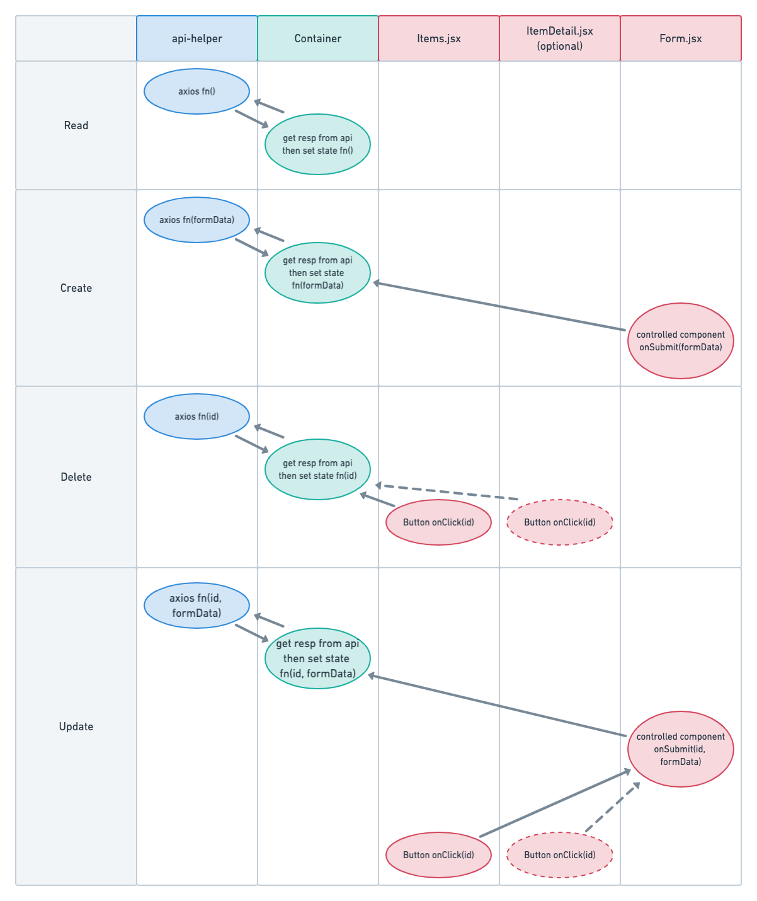

# Frontend CRUD Design

### Objectives

After this lesson, you should be able to:

- recognize the structure of a full CRUD front-end client
- describe the importance of the front-end in a RESTful web application
- be able to connect together all the different components of a full CRUD client

## RESTful Web Apps

One of the qualifications for a RESTful web app is that the client is separate from the back-end server in order keep concerns separated.

1. The two must work independently from each other. The client could be swapped out for a different front-end and vice versa.
2. The backend endpoints must follow a uniform pattern (i.e. GET /projects, POST /projects, etc).
3. Also the back-end must be "stateless". It shouldn't store any information about the requests it receives and each request should be treated as a brand new independent request.
4. The frontend must be able to cache the data it receives to improve performance. Have you ever received a network response of `304` when making repeated requests? The `304` status code stands for "not modified" and means that the data if identical to a previously cached response.
5. Also the frontend must not have any idea of what's going on in the back-end. The endpoint it hits could be an API that is accessing the database _or_ it could just be chaining to another API to get additional data. The whole idea is that each layer works independently from each other and is unaware of what the other layers do.

## Starting the Front-end

If we already have our routes for our API, or if we are assuming that the routes follow convention, we have everything we need to build out our axios calls. Let's take a look at how those should look:

Read All:

```
export const getAllItems = async () => {
  const resp = await axios.get(`${BASE_URL}/items`);
  return resp.data;
};
```

Notice how we don't need any more data than the base url and the url path for our endpoint. In this example, we can assume that the `BASE_URL` variable was set to the base url that we want to hit.

Read One:

```
export const getOneItem = async (id) => {
  const resp = await axios.get(`${BASE_URL}/items/${id}`);
  return resp.data;
}
```

This API call looks very similar to our previous one except that it takes the `id` of the item that we want to get. We don't need to worry about what the id's value is in this function. Our only concern is to pass it to the path of our endpoint as a param. Separation of concerns!

Delete/Destroy:

```
export const destroyItem = async (id) => {
  const resp = await axios.delete(`${BASE_URL}/items/${id}`);
  return resp;
}
```

At a glance, it almost looks like we didn't change anything here. The only difference is the axios method is now delete instead of get. We still pass in the id of the item that we are referring to. Additionally since there may not be data in our response, we only need to return `resp`. It might have an error message that we would want to handle so we still return it. (Also, the function name is different, in case you're copy/pasting your previous function).


Create:

```
export const postItem = async (itemData) => {
  const resp = await axios.post(`${BASE_URL}/items`, itemData);
  return resp.data;
}
```

This time, we are passing in data for the item that we want to store in the database. However, we don't pass it as a param; Axios `POST` and `PUT` methods can take a second argument, which will be the body of our request.

Update:

```
export const putItem = async (id, updatedData) => {
  const resp = await axios.put(`${BASE_URL}/items/${id}`, updatedData);
  return resp.data;
}
```

Here we have both the item's id and the updated data for that item. It's almost a combination of the `create` and `getOne`/`delete` API calls.

## Component Structure

So what's next? We don't have much in our app right now outside of these API calls that we're not using. This is where having nice wireframes comes in handy. For a larger project, the more comprehensive our wireframes are, the easier it will be to build out our components. But for right now, let's take a look at a simple component tree:



It looks like all four of our components are being called from a container component. The container component typically doesn't actually have any rendering jsx tags. It is just there to have on unified place to store state. We can then pass that state down to our various "screens" components that will render that data. This concept is referred to as raising state. It is very important to make sure our state is raised as high as is needs to be in our app. Other wise we will run into problems with the data in state not refreshing with the rest of our app. Or we will find ourselves backed into a corner, where our data is locked in a sibling or child component and we cant access it. Remember, data in react only flows down.

## Function/Data Placement 

 Where do our methods go? This is also a good use for our container component. We will need functions in our react app that gets the data from our API call responses and then sets state.
 
 > Note: Prior to React Hooks, these functions needed to be in the same component that we were storing state. Now we have more freedom and can pass the `setState` functions where ever.
 
 In order to stay organized, it's probably a good idea to keep all of this logic separate from our other components. The "screens" and "components" can focus on just displaying data and the "containers" can focus on state.

When we have our methods in a "Container" component, we simply need to pass them down to our child components to be able to call them when we need them. Here's a diagram of how functions flow typically in a CRUD app:



There are a lot of moving parts here. If we don't need to have a separate view for a single item, we can just keep our "edit" and "delete" button on the items in our item list. Then we could remove the `ItemDetail` component from this list.

### Read

Looking at this diagram, we see that `read` looks pretty simple. It's a function in api-helper that makes our axios call and another function in App that sets state. We could call our setState function in a `useEffect` if we wanted our data to load with the page.

### Create

Create is the same but it needs to get data from the form first. Also, it isn't triggered until the form is submitted.

### Delete

Delete doesn't need form data, but it does need the `id` of a single item. We can get this from the `.map` inside of our item list screen or from the individual item screen, if we have it. We can trigger this function with the onClick of a button.

### Update

Update has the most moving parts here, but it's really just a combination of delete and create. We start with an onClick in the item list or single item page view. We need to pass the `id` along to the edit form component. That will allow us to find the data for the item to pre-populate our edit form. We'll also need the `id` once the update form is submitted. We need to replace our empty form data in state with the item's data. The user should be looking at a form with the items already in it, ready to be updated. From here, it's the same as create. On submit, the form data is sent to our API call and then set in state of our app.

The only function that we are missing from the diagram is for our controlled component: `handleChange`. The `formData` state and `handleChange` can be contained in the form component since it is not used anywhere else in our app.

## Setting State

We have four different setState functions in our app and they all need to behave differently. Let's look at how they should look and see what they are doing. This is assuming that we are dealing with a list of `items` that started off as an empty array when we instantiate our `useState`.

>example: `const [items, setItems] = useState([])`

### Read

```
setItems(items);
```

This one is pretty simple since it only needs to set up our initial state.

### Create

```
setItems(prevState => ([...prevState, newItem]))
```

State is immutable and we can't change it. However we _can_ replace state with something new. This is where `prevState` comes in handy. In this `setItems`, we are replacing `items` with a new array. Inside that array, we spread out all the contents of the items that were in state previously and add our new item.

### Update

```
setItems(prevState => (prevState.map(item => {
  return item.id === updatedId ? newItem : item
}))
```

Update again seems like it has a lot going on but we can break it down to three different pieces that we're all familiar with.

1. First, we setItems with prevState.
2. Next, we map through our previous items. remember, `.map` returns a new array so we are still replacing state and not mutating it.
3. Inside our map, we have a ternary. It is checking for the item id that matches the id of the item we updated. For that one item, we return our updated item from our api call. For all other items, we return the previous item.

### Delete

```
setItems(prevState => {
  return prevState.filter(item => item.id !== deletedId)
})
```

Delete is pretty similar to update here except that we are filtering out our deleted item. We only want the items that don't match the id of the one we deleted.
